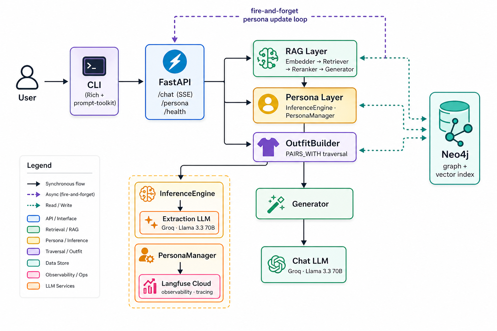
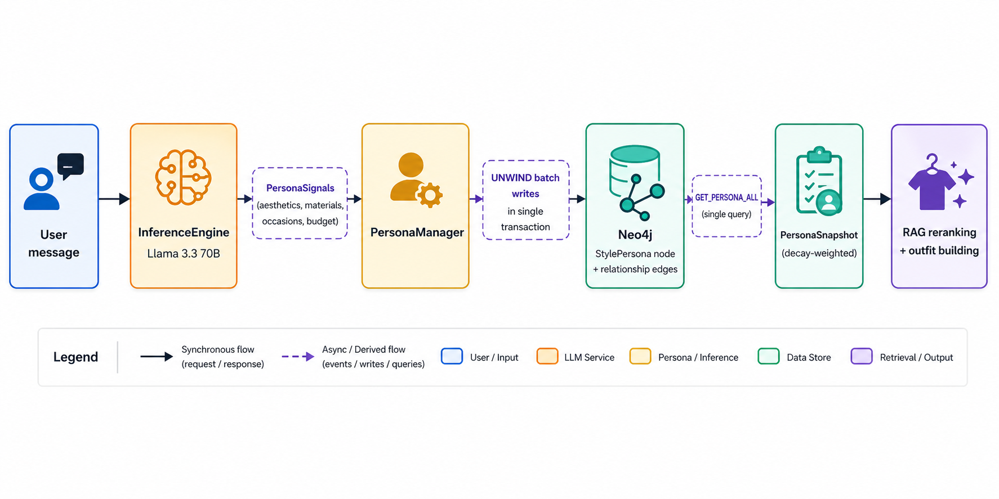
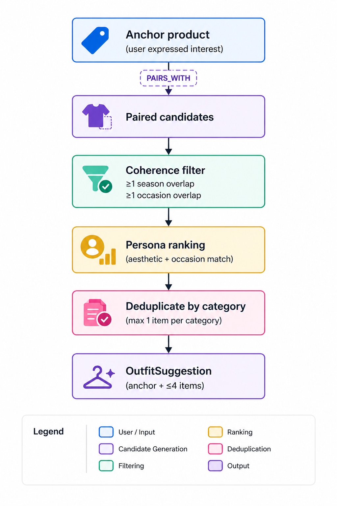

<div align="center">
  

  <h1>StyleMind</h1>

  <p><strong>An AI-powered fashion styling assistant that silently learns your taste through conversation </strong></p>

  <p>
    StyleMind combines a Neo4j knowledge graph, vector similarity search, and an LLM pipeline to deliver persona-aware outfit recommendations that improve with every message.
  </p>
  <p>
    Watch Demo 
  </p>
</div>

---

## Architecture



## Quick Start

```bash
cp .env.example .env        # set CHAT_API_KEY (Groq), EXTRACTION_API_KEY (Groq), NEO4J_PASSWORD
make db-up && make seed-and-embed   # start Neo4j, seed graph, build embeddings
make web-chat                       # launch the web UI at http://localhost:8000
```

Web UI at `http://localhost:8000`. API docs at `http://localhost:8001/docs`. Neo4j Browser at `http://localhost:7474`.

## Tech Stack

| Layer | Choice | Notes |
|-------|--------|-------|
| Language | Python 3.14 | `uv` + hatchling |
| Graph + Vector DB | Neo4j 5 Community | One DB: graph traversal + native vector index |
| Chat LLM | Groq · Llama 3.3 70B | OpenAI-compatible SDK, swap via `CHAT_BASE_URL` |
| Extraction LLM | Groq · Llama 3.3 70B | Structured output (JSON schema), swap via `EXTRACTION_BASE_URL` |
| Embeddings | all-MiniLM-L6-v2 | Local, 384 dims, no API key |
| API | FastAPI + SSE | Streaming tokens, async lifespan (port 8001) |
| Web UI | Streamlit | Browser-based boutique chat, auto-starts API, slash commands (port 8000) |
| CLI | Rich + prompt-toolkit | Terminal chat, embeds FastAPI in background thread |
| Observability | Langfuse Cloud | `@observe` spans across full pipeline, token usage, persona confidence scores |
| Packaging | Docker (two-stage, non-root) | `docker-compose up --build` starts everything |

## API Endpoints

| Method | Endpoint | Description |
|--------|----------|-------------|
| `POST` | `/chat` | Streaming chat via SSE — persona-aware RAG pipeline |
| `GET` | `/persona/{user_id}` | Current inferred persona snapshot |
| `GET` | `/outfit/{product_id}` | Build a coherent outfit around an anchor product |
| `GET` | `/products/names` | Product catalog for autocomplete |
| `GET` | `/health` | Liveness check (Neo4j + embedder) |

## Chat Interfaces

### Web UI (default)

```bash
make web-chat   # opens http://localhost:8000
```

The Streamlit app auto-starts the FastAPI backend on port 8001.

| Slash Command | Description |
|---------------|-------------|
| `/persona` | Show current persona snapshot in sidebar |
| `/outfit <product>` | Build outfit around a product name |
| `/help` | Show command reference |
| `/reset` | Clear conversation history |
| `/debug` | Toggle raw signal debug output |

### Terminal CLI

```bash
uv run python -m stylemind   # or: make chat
```

| Command | Action |
|---------|--------|
| `/help` | Show all commands and conversation starters |
| `/persona` | Print inferred style persona |
| `/outfit <name>` | Build outfit around a product (fuzzy match + tab-complete) |
| `/debug-dev` | Per-turn persona signals extracted this session |
| `/clear` | Clear conversation history |
| `/exit` | End session (also: `/quit`, `quit`, `exit`) |

Product names support **tab-completion** anywhere in the input.

## How It Works

### RAG pipeline (per chat turn)


### Persona inference & storage



### Outfit builder graph traversal



## Observability

| Service | URL |
|---------|-----|
| Langfuse Cloud | [us.cloud.langfuse.com](https://us.cloud.langfuse.com) |
| Neo4j Browser | [localhost:7474](http://localhost:7474) |

Langfuse captures per-turn spans for retrieval, reranking, persona extraction, generation, and outfit building. Token usage (prompt/completion/total) is logged for both LLMs. `score_persona_confidence` is emitted each turn for drift detection.

The `/debug-dev` CLI command provides a local alternative — all persona signals extracted during the session as a Rich table, no network required.

## Docs

| Document | Description |
|----------|-------------|
| [Design Decisions & Dev Setup](design.md) | Architecture rationale, environment variables, local development, troubleshooting |
