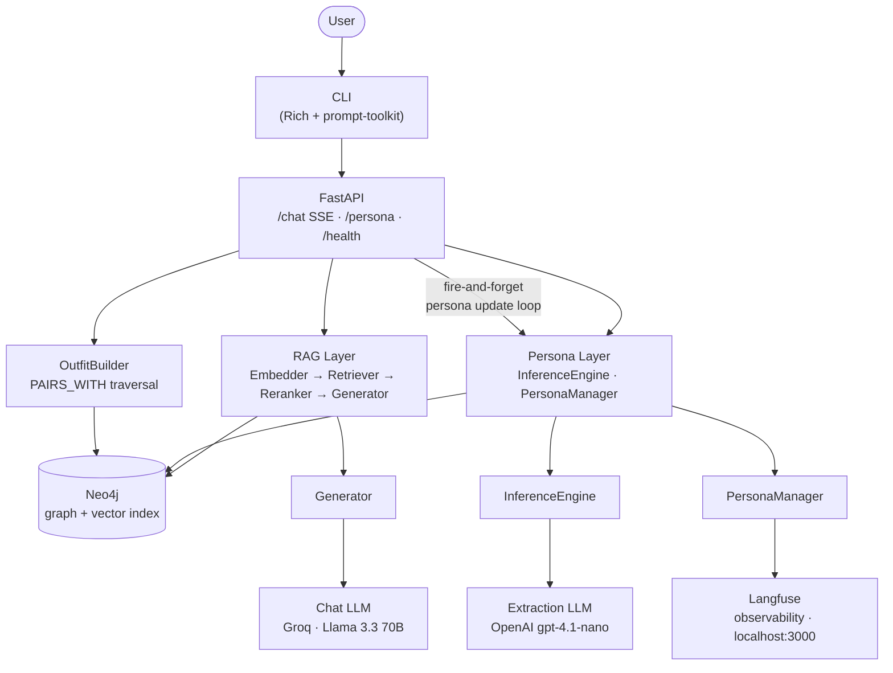

**StyleMind is a RAG-powered fashion chatbot that silently learns your style persona through conversation and recommends outfits via Neo4j graph traversal.**

## Architecture



## Quick Start

```bash
cp .env.example .env        # edit .env — add GROQ_API_KEY and OPENAI_API_KEY
docker-compose up --build   # seed + embed scripts run automatically on startup
```

That's it. The app is available at `http://localhost:8000`. Langfuse at `http://localhost:3000`. Neo4j Browser at `http://localhost:7474`.

## API Endpoints

| Method | Endpoint | Description | Request | Response |
|--------|----------|-------------|---------|----------|
| `POST` | `/chat` | Streaming chat with persona-aware RAG | `ChatRequest { user_id, message, history, explain }` | SSE stream of tokens + optional explain block |
| `GET` | `/persona/{user_id}` | Current inferred persona snapshot | — | `PersonaSnapshot` JSON |
| `GET` | `/health` | Liveness check (Neo4j + embedder) | — | `200 OK` or `503` |

## CLI Usage

```bash
uv run python -m stylemind
```

Within the chat session:

| Command | Action |
|---------|--------|
| `/persona` | Print the current inferred persona snapshot |
| `quit` / `exit` | End the session |

## Design Decisions

- **Neo4j as unified graph + vector store** — products, relationships, and 384-dim embeddings live in one database. Vector search and graph traversal run in a single Cypher pipeline, eliminating sync complexity and the fan-out latency of a separate vector DB.

- **Framework-free** — no LangChain, no LlamaIndex. Every retrieval step, reranking pass, and prompt template is explicit Python. When something breaks or behaves unexpectedly, there is no abstraction layer to blame.

- **Split-model architecture** — Groq + Llama 3.3 70B handles streaming chat for sub-200 ms TTFT. OpenAI gpt-4.1-nano handles structured persona extraction where JSON-schema conformance matters more than speed. Using the fastest model everywhere would sacrifice reliability; using the most reliable model everywhere would add latency.

- **Provider-agnostic LLM clients** — both clients are `OpenAI(base_url=..., api_key=...)`. Swapping providers is two environment variable changes. No SDK rewrites, no abstraction layer needed.

- **Silent persona inference** — the system never asks users what they like. Preferences are extracted from conversational signals (liked aesthetics, disliked materials, budget cues, sentiment on shown products) after every turn. Asking directly breaks conversational flow and primes users to game the system.

- **Langfuse for turn-level observability** — `@observe` spans on retrieve, rerank, extract_signals, and build_outfit. `score_persona_confidence` is logged each turn. Debugging RAG quality and persona drift requires turn-level traces, not aggregate metrics.

- **Outfit coherence via graph traversal** — outfit candidates are validated by requiring ≥1 season overlap AND ≥1 occasion overlap using `PAIRS_WITH` edges in Neo4j. This is deterministic and explainable. Letting the LLM guess outfit coherence would produce plausible-sounding but fashion-incoherent combinations.

## Project Structure

```
src/stylemind/
├── config.py          # AppConfig frozen dataclass, thread-safe singleton
├── main.py            # FastAPI app + lifespan (startup: seed + embed)
├── __main__.py        # CLI entry — starts server in bg thread
├── observability.py   # Langfuse @observe wrappers + persona confidence scoring
├── models/
│   ├── enums.py       # StrEnum: Aesthetic, Occasion, Season, BudgetTier, …
│   ├── schemas.py     # Pydantic: ChatRequest, PersonaSnapshot, PersonaSignals
│   └── domain.py      # frozen @dataclass: Product, OutfitSet, RerankedResult
├── graph/
│   ├── client.py      # Neo4j driver wrapper
│   ├── queries.py     # Cypher query constants
│   └── repository.py  # typed graph read/write methods
├── rag/
│   ├── embedder.py    # sentence-transformers/all-MiniLM-L6-v2 (384 dims)
│   ├── retriever.py   # vector search + persona-filtered Cypher
│   ├── reranker.py    # persona-aware cross-encoder reranking
│   └── generator.py   # streaming response generation (Groq)
├── persona/
│   ├── inference.py   # LLM-based PersonaSignals extraction (gpt-4.1-nano)
│   └── manager.py     # weighted edge storage + temporal decay in Neo4j
├── outfit/
│   └── builder.py     # PAIRS_WITH traversal + coherence validation
├── api/
│   ├── chat.py        # POST /chat — SSE streaming endpoint
│   ├── persona.py     # GET /persona/{user_id}
│   └── health.py      # GET /health
└── cli/
    └── chat.py        # Rich console + prompt-toolkit REPL

scripts/
├── seed.py            # idempotent MERGE-based graph seeding (51 products)
└── embed.py           # batch-embed products into Neo4j vector index

data/
└── products_seed.csv  # 45 products (RTL CSV parser — 4 rows have unquoted commas)

tests/                 # pytest, asyncio_mode=auto, unit/integration/e2e/performance
```

## Running Tests

```bash
make test                  # all tests
pytest -m unit             # unit tests only
pytest -m integration      # integration tests (requires Neo4j)
pytest -m performance      # benchmarks
```

## Observability

| Service | URL | Credentials |
|---------|-----|-------------|
| Langfuse | http://localhost:3000 | set in `.env` |
| Neo4j Browser | http://localhost:7474 | `neo4j` / set in `.env` |

Langfuse captures per-turn spans for retrieval, reranking, persona extraction, and outfit building. `score_persona_confidence` is emitted each turn, enabling drift detection over sessions.

## Tech Stack

| Layer | Choice | Notes |
|-------|--------|-------|
| Language | Python 3.14 | `uv` + hatchling |
| Graph + Vector DB | Neo4j 5 Community | One DB: graph traversal + native vector index |
| Chat LLM | Groq · Llama 3.3 70B | OpenAI-compatible SDK, swap via `CHAT_BASE_URL` |
| Extraction LLM | OpenAI gpt-4.1-nano | Structured output (JSON schema), swap via `EXTRACTION_BASE_URL` |
| Embeddings | all-MiniLM-L6-v2 | Local, 384 dims, no API key |
| API | FastAPI + SSE | Streaming tokens, async lifespan |
| CLI | Rich + prompt-toolkit | Embeds FastAPI server in background thread |
| Observability | Langfuse (self-hosted) | `@observe` spans, persona confidence scores |
| Packaging | Docker (two-stage, non-root) | `docker-compose up --build` starts everything |
