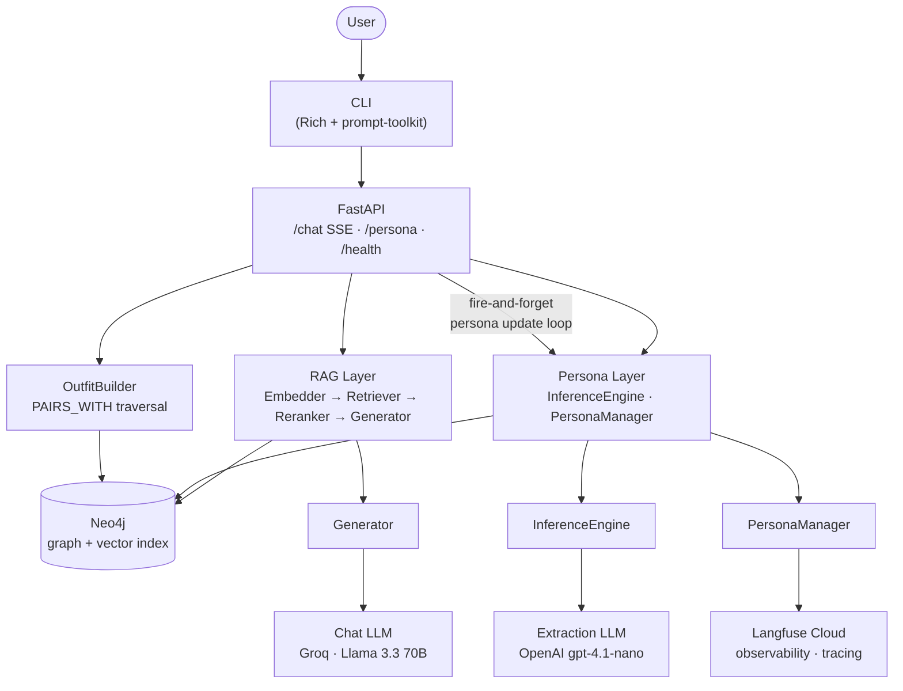
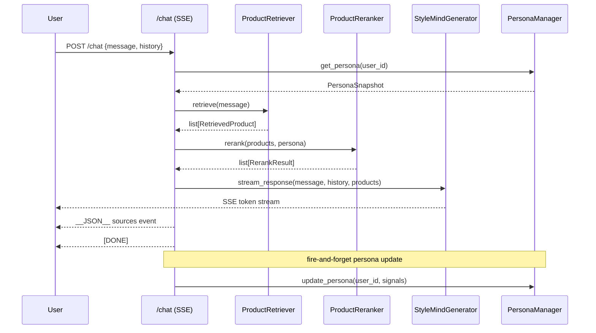
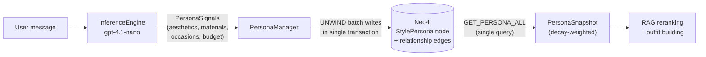
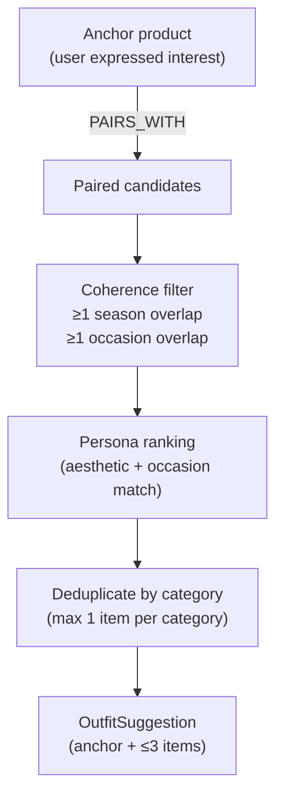

**StyleMind is a RAG-powered fashion chatbot that silently learns your style persona through conversation and recommends outfits via Neo4j graph traversal.**

## Architecture



## Quick Start

```bash
cp .env.example .env        # edit .env — set CHAT_API_KEY (Groq) and EXTRACTION_API_KEY (OpenAI)
docker-compose up --build   # seed + embed scripts run automatically on startup
```

That's it. The app is available at `http://localhost:8000`. Neo4j Browser at `http://localhost:7474`. Traces are sent to [Langfuse Cloud](https://us.cloud.langfuse.com) (configure keys in `.env`).

## API Endpoints

| Method | Endpoint | Description | Request | Response |
|--------|----------|-------------|---------|----------|
| `POST` | `/chat` | Streaming chat with persona-aware RAG | `ChatRequest { user_id, message, history, explain }` | SSE stream of tokens + structured JSON events |
| `GET` | `/persona/{user_id}` | Current inferred persona snapshot | — | `PersonaSnapshot` JSON |
| `GET` | `/outfit/{product_id}` | Build a coherent outfit around an anchor product | `?user_id=` (optional) | `OutfitSuggestion` JSON |
| `GET` | `/products/names` | List all product names with IDs (for autocomplete) | — | `list[{product_id, name, brand}]` |
| `GET` | `/health` | Liveness check (Neo4j + embedder) | — | `200 OK` or `503` |

## CLI Usage

```bash
uv run python -m stylemind
```

Within the chat session:

| Command | Action |
|---------|--------|
| `/help` | Show all available commands and conversation starters |
| `/persona` | Print the current inferred persona snapshot |
| `/outfit <name>` | Build a complete outfit around a product (fuzzy name matching + tab-complete) |
| `/debug-dev` | Show per-turn persona signals extracted this session (developer tool) |
| `/clear` | Clear conversation history and start fresh |
| `/exit` or `/quit` | End the session (also: `quit`, `exit`) |
| `1` / `2` / `3` | Use a conversation starter (shown on welcome screen) |

Product names support **tab-completion** — start typing and press Tab.

## Design Decisions

- **Neo4j as unified graph + vector store** — products, relationships, and 384-dim embeddings live in one database. Vector search and graph traversal run in a single Cypher pipeline, eliminating sync complexity and the fan-out latency of a separate vector DB.

- **Framework-free** — no LangChain, no LlamaIndex. Every retrieval step, reranking pass, and prompt template is explicit Python. When something breaks or behaves unexpectedly, there is no abstraction layer to blame.

- **Split-model architecture** — Groq + Llama 3.3 70B handles streaming chat for sub-200 ms TTFT. OpenAI gpt-4.1-nano handles structured persona extraction where JSON-schema conformance matters more than speed. Using the fastest model everywhere would sacrifice reliability; using the most reliable model everywhere would add latency.

- **Provider-agnostic LLM clients** — both clients are `OpenAI(base_url=..., api_key=...)`. Swapping providers is two environment variable changes. No SDK rewrites, no abstraction layer needed.

- **Silent persona inference** — the system never asks users what they like. Preferences are extracted from conversational signals (liked aesthetics, disliked materials, budget cues, sentiment on shown products) after every turn. Asking directly breaks conversational flow and primes users to game the system.

- **Langfuse Cloud for turn-level observability** — `@observe` spans on retrieve, rerank, extract_signals, stream_response, get_persona, update_persona, and build_outfit. Token usage logged per LLM call. `score_persona_confidence` emitted each turn. Debugging RAG quality and persona drift requires turn-level traces, not aggregate metrics. Local Langfuse removed from docker-compose — cloud-hosted reduces infra complexity and makes traces accessible anywhere.

- **Outfit coherence via graph traversal** — outfit candidates are validated by requiring ≥1 season overlap AND ≥1 occasion overlap using `PAIRS_WITH` edges in Neo4j. This is deterministic and explainable. Letting the LLM guess outfit coherence would produce plausible-sounding but fashion-incoherent combinations.

## Project Structure

```
src/stylemind/
├── config.py          # AppConfig frozen dataclass, thread-safe singleton
├── main.py            # FastAPI app + lifespan (startup: seed + embed)
├── __main__.py        # CLI entry — starts server in bg thread
├── observability.py   # Langfuse @observe wrappers + persona confidence scoring
├── models/
│   ├── enums.py       # StrEnum: Aesthetic, Occasion, Season, BudgetTier, …
│   ├── schemas.py     # Pydantic: ChatRequest, PersonaSnapshot, PersonaSignals
│   └── domain.py      # frozen @dataclass: Product, OutfitSet, RerankedResult
├── graph/
│   ├── client.py      # Neo4j driver wrapper
│   ├── queries.py     # Cypher query constants
│   └── repository.py  # typed graph read/write methods
├── rag/
│   ├── embedder.py    # sentence-transformers/all-MiniLM-L6-v2 (384 dims)
│   ├── retriever.py   # vector search + persona-filtered Cypher
│   ├── reranker.py    # persona-aware cross-encoder reranking
│   └── generator.py   # streaming response generation (Groq)
├── persona/
│   ├── inference.py   # LLM-based PersonaSignals extraction (gpt-4.1-nano)
│   └── manager.py     # weighted edge storage + temporal decay in Neo4j
├── outfit/
│   └── builder.py     # PAIRS_WITH traversal + coherence validation
├── api/
│   ├── chat.py        # POST /chat — SSE streaming endpoint
│   ├── persona.py     # GET /persona/{user_id}
│   └── health.py      # GET /health
└── cli/
    └── chat.py        # Rich console + prompt-toolkit REPL

scripts/
├── seed.py            # idempotent MERGE-based graph seeding (51 products)
└── embed.py           # batch-embed products into Neo4j vector index

data/
└── products_seed.csv  # 45 products (RTL CSV parser — 4 rows have unquoted commas)

tests/                 # pytest, asyncio_mode=auto, unit/integration/e2e/performance
```

## Environment Variables

| Variable | Required | Default | Description |
|----------|----------|---------|-------------|
| `CHAT_API_KEY` | ✅ | — | API key for the chat LLM provider (Groq by default) |
| `EXTRACTION_API_KEY` | ✅ | — | API key for the extraction LLM (OpenAI by default) |
| `NEO4J_PASSWORD` | ✅ | — | Neo4j password (must match `NEO4J_AUTH` in docker-compose) |
| `CHAT_BASE_URL` | ❌ | `https://api.groq.com/openai/v1` | OpenAI-compatible endpoint for the chat model |
| `CHAT_MODEL` | ❌ | `llama-3.3-70b-versatile` | Model ID passed to the chat endpoint |
| `CHAT_TEMPERATURE` | ❌ | `0.7` | Sampling temperature for chat completions |
| `EXTRACTION_BASE_URL` | ❌ | `https://api.openai.com/v1` | OpenAI-compatible endpoint for extraction |
| `EXTRACTION_MODEL` | ❌ | `gpt-4.1-nano` | Model ID for persona signal extraction |
| `NEO4J_URI` | ❌ | `bolt://localhost:7687` | Neo4j bolt URI |
| `NEO4J_USER` | ❌ | `neo4j` | Neo4j username |
| `EMBEDDING_PROVIDER` | ❌ | `local` | `local` (sentence-transformers) or `openai` |
| `EMBEDDING_MODEL` | ❌ | `sentence-transformers/all-MiniLM-L6-v2` | Embedding model name |
| `EMBEDDING_DIMENSIONS` | ❌ | `384` | Embedding vector dimensions |
| `CORS_ORIGINS` | ❌ | `*` | Comma-separated allowed CORS origins; restrict in production |
| `LOG_LEVEL` | ❌ | `INFO` | Python logging level |
| `VECTOR_TOP_K` | ❌ | `10` | Number of candidates retrieved per query |
| `PERSONA_DECAY_RATE` | ❌ | `0.15` | Exponential decay rate for persona signal weights per turn |
| `EXPECTED_SIGNALS_PER_TURN` | ❌ | `3.0` | Denominator for persona confidence calculation |
| `MIN_SIMILARITY_THRESHOLD` | ❌ | `0.3` | Minimum cosine similarity to include a product |
| `LANGFUSE_PUBLIC_KEY` | ❌ | — | Leave empty to disable Langfuse tracing |
| `LANGFUSE_SECRET_KEY` | ❌ | — | Leave empty to disable Langfuse tracing |
| `LANGFUSE_HOST` | ❌ | `http://localhost:3000` | Langfuse server URL |
| `SERVER_PORT` | ❌ | `8000` | Port used by the CLI's embedded server |

## Local Development Workflow

```bash
# 1. Install dependencies
uv sync --dev

# 2. Start Neo4j
docker-compose up neo4j -d

# 3. Copy and edit env
cp .env.example .env
# Set CHAT_API_KEY, EXTRACTION_API_KEY, NEO4J_PASSWORD at minimum

# 4. Seed the graph and embed products
uv run python scripts/seed.py
uv run python scripts/embed.py

# 5. Start the API server
uv run uvicorn stylemind.main:app --reload

# 6. Or launch the CLI (starts server automatically in background)
uv run python -m stylemind
```

**Install pre-commit hooks** (runs ruff, pyright, and unit tests on every commit):

```bash
uv run pre-commit install
```

## Running Tests

```bash
make test                  # all tests
pytest -m unit             # unit tests only (no Neo4j required)
pytest -m integration      # integration tests (requires Neo4j running)
pytest -m performance      # benchmarks
```

## Troubleshooting

**`NEO4J_PASSWORD` not set** — the app raises `ValueError: Required environment variable 'NEO4J_PASSWORD' is not set` on startup. Copy `.env.example` to `.env` and fill in the required values.

**Neo4j not ready** — the CLI polls `/health` for up to 30 s before exiting. If it times out, check `docker-compose logs neo4j` and ensure the password in `.env` matches `NEO4J_AUTH` in `docker-compose.yml`.

**Empty responses / no products retrieved** — check that `scripts/embed.py` ran successfully. Products need embeddings in Neo4j before vector search works. Re-run `uv run python scripts/embed.py`.

**Persona not updating** — persona updates are fire-and-forget after the SSE stream closes. Check logs for `chat persona update failed`. Common causes: Neo4j connectivity blip, or `EXTRACTION_API_KEY` missing/invalid.

**CORS errors in browser** — set `CORS_ORIGINS=https://your-frontend.example.com` in `.env` (comma-separated for multiple origins).

**Langfuse traces not appearing** — verify `LANGFUSE_PUBLIC_KEY` and `LANGFUSE_SECRET_KEY` are set and the Langfuse server is reachable at `LANGFUSE_HOST`. The app degrades gracefully if Langfuse is unavailable.

## Architecture Sub-Diagrams

### RAG pipeline (per chat turn)



### Persona inference & storage



### Outfit builder graph traversal



## Observability

| Service | URL | Credentials |
|---------|-----|-------------|
| Langfuse Cloud | https://us.cloud.langfuse.com | `LANGFUSE_PUBLIC_KEY` / `LANGFUSE_SECRET_KEY` in `.env` |
| Neo4j Browser | http://localhost:7474 | `neo4j` / `NEO4J_PASSWORD` in `.env` |

Langfuse captures per-turn spans for retrieval, reranking, persona extraction, generation, and outfit building. Token usage (prompt/completion/total) is logged for both Chat LLM and Extraction LLM. `score_persona_confidence` is emitted each turn, enabling drift detection over sessions.

The `/debug-dev` CLI command provides a local, no-network alternative: it shows all persona signals extracted during the current session as a Rich table — useful for rapid iteration without opening the Langfuse dashboard.

## Tech Stack

| Layer | Choice | Notes |
|-------|--------|-------|
| Language | Python 3.14 | `uv` + hatchling |
| Graph + Vector DB | Neo4j 5 Community | One DB: graph traversal + native vector index |
| Chat LLM | Groq · Llama 3.3 70B | OpenAI-compatible SDK, swap via `CHAT_BASE_URL` |
| Extraction LLM | OpenAI gpt-4.1-nano | Structured output (JSON schema), swap via `EXTRACTION_BASE_URL` |
| Embeddings | all-MiniLM-L6-v2 | Local, 384 dims, no API key |
| API | FastAPI + SSE | Streaming tokens, async lifespan |
| CLI | Rich + prompt-toolkit | Embeds FastAPI server in background thread |
| Observability | Langfuse Cloud | `@observe` spans across full pipeline, token usage, persona confidence scores |
| Packaging | Docker (two-stage, non-root) | `docker-compose up --build` starts everything |
